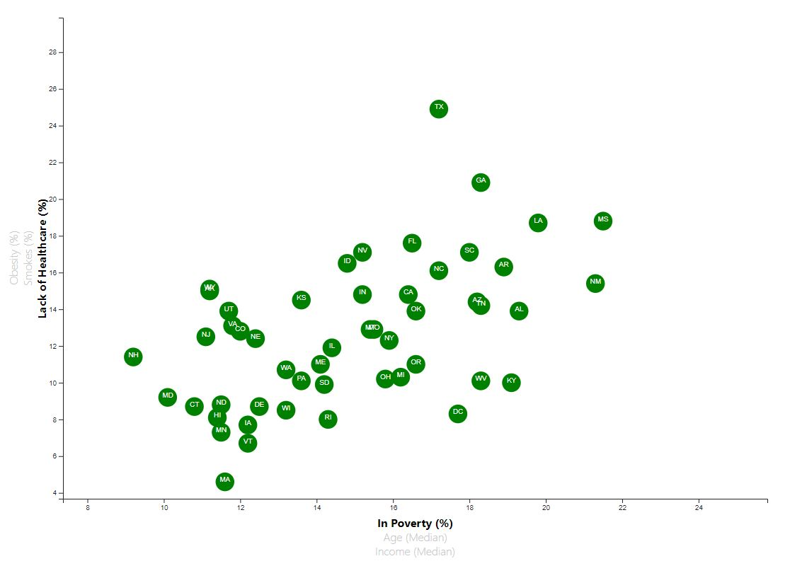
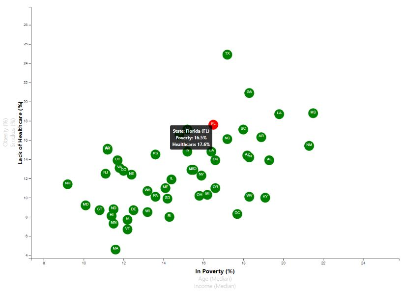

# D3-Challenge - Data Journalism and D3

## Background

Welcome to the newsroom! Having accepted a data visualization position for a major metro paper, the mission is analyzing the current trends shaping people's lives, as well as creating charts, graphs, and interactive elements to help readers understand significant findings.

The editor wants to run a series of feature stories about the health risks facing particular demographics. Counting on this data analytics team, the editor desires the team to sniff out the first story idea by sifting through information from the U.S. Census Bureau and the Behavioral Risk Factor Surveillance System.

The data set included with the assignment is based on 2014 ACS 1-year estimates from the [US Census Bureau](https://data.census.gov/cedsci/). The current data set includes data on rates of income, obesity, poverty, etc. by each US State. MOE stands for "margin of error."

The finalized app has been deployed to github page. Click [here](https://jonathanezeugo.github.io/D3-Challenge/StarterCode/index.html) to or [here]('./index.html') view the rendered page.

### The mission: D3 Dabbler 

A scatter plot was created between two of the data variables such as `Healthcare vs. Poverty` or `Smokers vs. Age`. This scatter plot was created to represent each state with circle elements. A VS script was used to code this graphic in the `app.js` file and the data from `data.csv` was imported by using the `d3.csv` function. The scatter plot ultimately appeared like the image at the top of this section.

* This included State abbreviations in the circles.

* Created and situated chart axes and labels to the left and bottom of the chart respectively.

* The finalized app has been deployed to github page. Click [here](https://jonathanezeugo.github.io/D3-Challenge/index.html) to view the rendered page.

### Bonus: Creating the interactive scatter plot

Why make a static graphic when D3 lets you interact with your data?

#### 1. More Data, More Dynamics

This bonus section included more demographics and more risk factors. Additional labels were placed in the scatter plot and given click events so that users can decide which data to display. The transitions were animated for circles' locations as well as the range of the axes. There are three risk factors for each axis. Here's what our chart looks like:

* Also all of the CSV data were bound to each circle, allowing for easily determining each x or y values when each label is clicked.

#### 2. Incorporating d3-tip

While the ticks on the axes allowed for inference of approximate values for each circle, it's impossible to determine the true value without adding another layer of data. Enter tooltips: developers can implement these in their D3 graphics to reveal a specific element's data when the user hovers their cursor over the element. Add tooltips to your circles and display each tooltip with the data that the user has selected. Use the `d3-tip.js` plugin developed by [Justin Palmer](https://github.com/Caged)—we've already included this plugin in your assignment directory.

